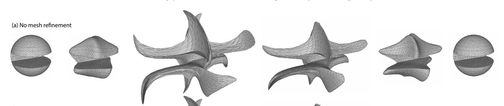
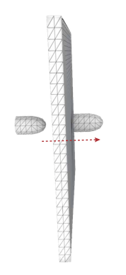
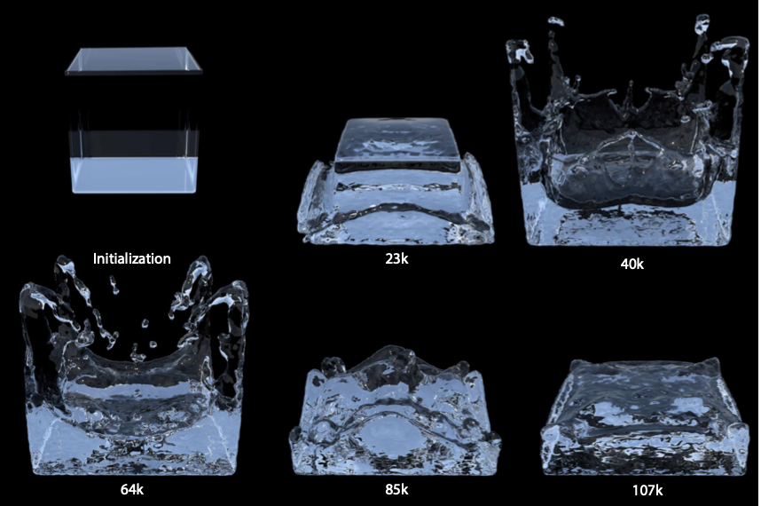
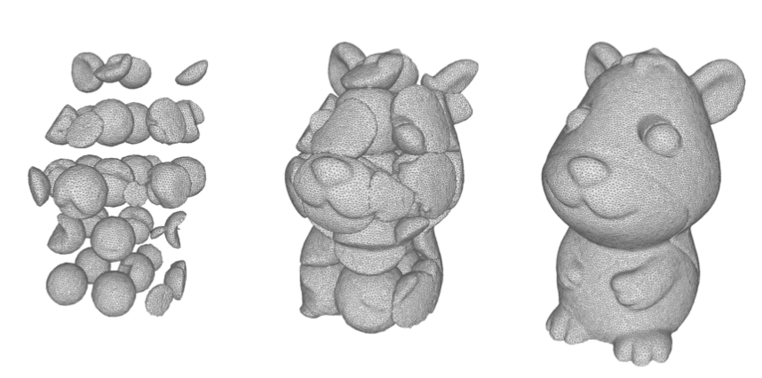
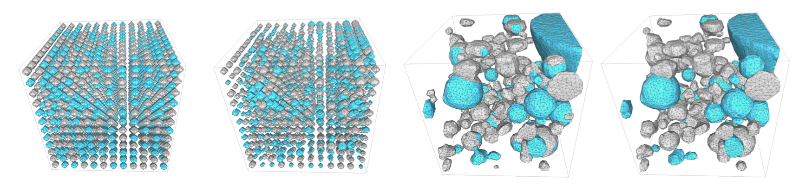

# Base framework for explicit tracking

[In progress]

This is a header only code, meaning you only need to add the directory to header search path.

The benchmarking include 5 velocity fields. Additional data file can be downloaded at [To be available](TBD)

## Enright

## Fast bullet

## Fluid 3D

## Segmentation 3D

## Multi-phase segmentation 3D
